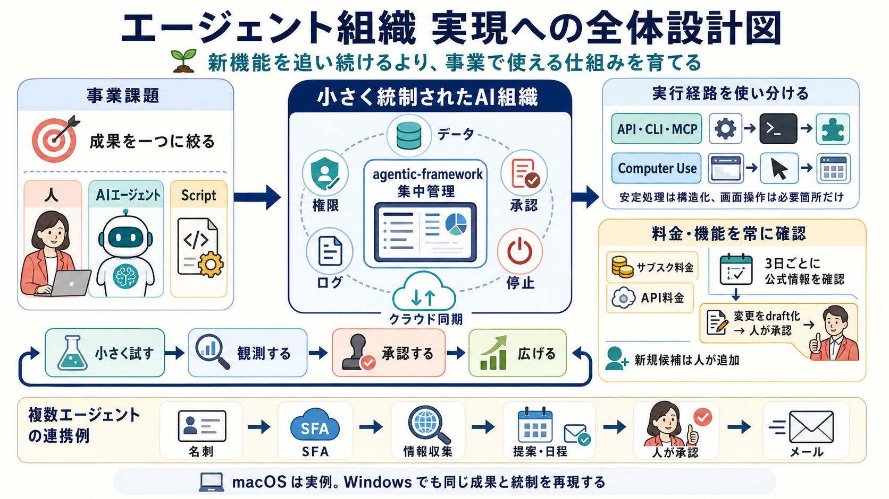

# エージェント組織導入ロードマップ

> **Evidence再調査中:** 2026-09-04に外部情報の選定方針を変更しました。既存claimは公開・更新から6か月未満の一次情報と独立したWeb・SNS評価を満たすまで、有効な根拠として使用しません。

AI の新機能を追い続けることではなく、事業課題へ安全かつ再現可能に活用するための正本です。技術に詳しくなくても、全体像を描き、今回試す範囲を一つに絞り、結果を判断できることを目指します。

## 一枚で見る全体像

## 読む順序

1. [対象者プロファイル](audiences/business-leader-ai-user.md)
2. [ロードマップ全体](roadmap.md)
3. [Stage 0: 全体を描く](stages/00-map.md)
4. [7領域の初期設計図](worksheets/system-map.md)
5. [Stage 1: 判断を補助させる](stages/01-decide.md)
6. [事業課題を一成果へ絞る](worksheets/problem-framing.md)
7. [Stage 2: 一作業を委任する](stages/02-delegate.md)
8. [一作業の委任定義](worksheets/delegation.md)
9. [Stage 3: 再現可能にする](stages/03-reproduce.md)
10. [Stage 4: 人・AI・Scriptの役割を分ける](stages/04-separate-roles.md)
11. [Stage 5: 組織として運用する](stages/05-operate.md)
12. [Stage 6: 品質と費用を最適化する](stages/06-optimize.md)
13. [効果・品質・費用の評価](worksheets/evaluation.md)

後続 Stage は調査、出典確認、レビューが完了した順に追加します。

## 正本と派生物

- このフォルダ: 対象者、設計図、成熟段階、判断方法の正本
- 実現パターン: クラウド同期、遠隔操作、CLI/MCP などの選択肢
- ケーススタディ: 市江氏の macOS 環境と、今後調査する Windows 代替
- Peitho deck: 正本から派生する発表資料。独自の判断基準を追加しない

## Evidence（旧形式・再調査中）

主張と出典の書き方は [evidence contract](evidence/README.md) に従います。

## 関連

- [設計仕様](../../../superpowers/specs/2026-09-03-agentic-organization-roadmap-design.md)
- [実装計画](../../../superpowers/plans/2026-09-03-agentic-organization-roadmap.md)
